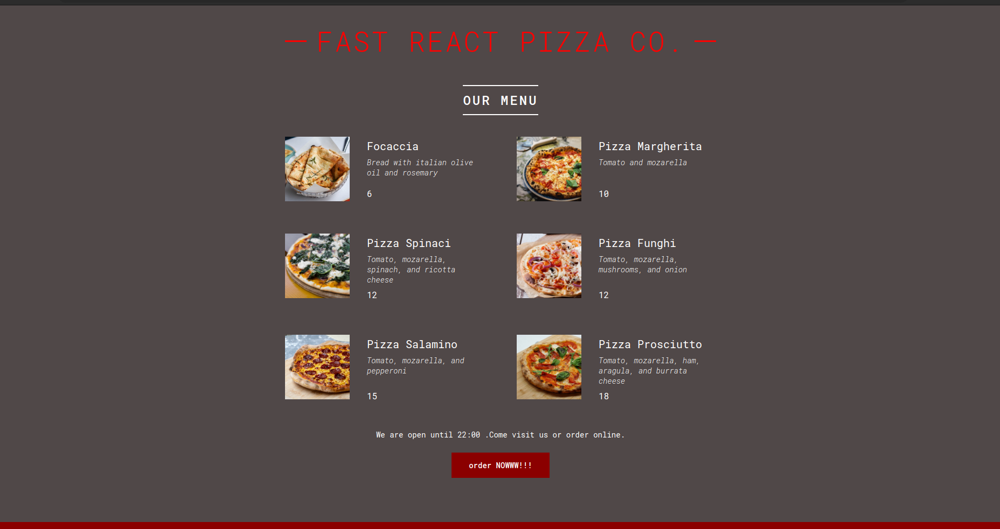

# React-pizza-menu 🍕

This project is a pizza menu built using React. It is a simple project created for the purpose of practicing React components. The menu displays a list of pizzas with their respective prices and allows the user to select the desired pizza and add it to their cart.The project is a great way to learn about React components.

## Available Scripts

In the project directory, you can run:

### `npm start`

Runs the app in the development mode.\
Open [http://localhost:3000](http://localhost:3000) to view it in your browser.

The page will reload when you make changes.\
You may also see any lint errors in the console.

## Built With

- React
- CSS
- JavaScript
- html

## Acknowledgments

- The Ultimate React Course 2023: React, Redux & More by Jonas Schmedtmann
